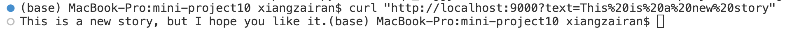

# Rust Serverless Transformer Endpoint

This project creates, dockernizes, and deploys a large language model (LLM) from Hugging Face using AWS Lambda. 

- Dockerize Hugging Face Rust transformer
- Deploy container to AWS Lambda
- Implement query endpoint

## LLM Model:

1. create a new cargo lambda project by doing ```cargo lambda new project_name```

2. Download the bloom-560m-q5_1-ggjt.bin file from https://huggingface.co/rustformers/bloomz-ggml/blob/main/bloomz-560m-q5_1-ggjt.bin, and put it under the src directory before running the project.

3. in main.rs, use the model to generate response.

## Local Test

4. test the functionality of the project by running ```cargo lambda watch```

5. open a new terminal, use curl to test the functionality:



## Dockerize Hugging Face Rust transformer

6. write docker file 
```
FROM ghcr.io/cargo-lambda/cargo-lambda:latest as builder
WORKDIR /usr/src/app
COPY . .
RUN cargo lambda build --release --arm64
FROM public.ecr.aws/lambda/provided:al2-arm64
WORKDIR /mini10_work
COPY --from=builder /usr/src/app/target/ ./ 
COPY --from=builder /usr/src/app/src/pythia-70m-q4_0-ggjt.bin ./ 
RUN if [ -d /mini10_work/lambda/mini10/ ]; then echo "Directory exists"; else echo "Directory does not exist"; fi
RUN if [ -f /mini10_work/lambda/mini10/bootstrap ]; then echo "File exists"; else echo "File does not exist"; fi
ENTRYPOINT ["/mini10_work/lambda/mini10/bootstrap"]
```

## Deploy container to AWS Lambda:

7 Create a new private repository of Elastic Containter Registry (ECR)

8 authenticate Docker to AWS ECR: ```aws ecr get-login-password --region us-east-1 | docker login --username AWS --password-stdin YOUR_AWS_ACCOUNT_NUMBER.dkr.ecr.us-east-1.amazonaws.com```

9 Build the Docker image: ```docker buildx build --progress=plain --platform linux/arm64 -t mini10 .```

10 Tag the image: ```docker tag mini10:latest YOUR_AWS_ACCOUNT_NUMBER.dkr.ecr.us-east-1.amazonaws.com/mini10:latest```

11 Push Docker image to ECR ```docker push YOUR_AWS_ACCOUNT_NUMBER.dkr.ecr.us-east-1.amazonaws.com/mini10:latest```


after pushing the docker image to ECR, we could see the image listed in the mini10 ECR


## Deploy the model to AWS Lambda:

12 Create a new Lambda function: choose option Container Image, and browse to pick the url for the docker image we just pushed to the ECR

13 Choose arm64 for this project, then create the function.

14 Click Create function URL to generate a new URL endpoint for the Lambda function.

15 Set general Configuration as below:


16 we could then test the functionality through the URL endpoint.


